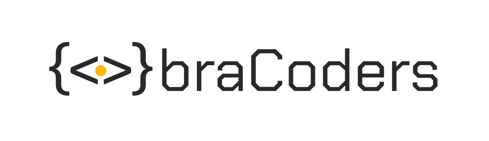

braCoders é um website com amontoado de links importantes como canais no youtube, livros, site de cursos, site de ilustrações, site de icones e muito mais. O objetivo do site é ajudar os iniciantes que estão entrando no mundo da tecnologia com os melhores links disponiveis na internet.
 
[Deploy](https://bracoders.vercel.app)

Decidi criar esse site porque quero ajudar as pessoas que estão comendo a estudar programação, assim juntando links de sites importantes, que estão espalhados na internet e juntando em um lugar só facilitando os estudos. Também é o meu primeiro site em react.js, então decidir colocar prática o que estou estudando em no último mês usando propriedades, hooks e componentes.

### O projeto é Open source?
O objetivo é incentivar as pessoas a alimentar o site para continuar ajudando e compartilhando links que ira ajudar as pessoas. Então se você quer contribuir com algum link faça o clone desse projeto e altere o arquivo json, adicionando nome, descrição, categoria, imagem e link do site que você quer adiconar.

**Obs:** A imagem deve ser em até **800x800(PNG OU JPG)** e adicionada na pasta public>siteImagens.
**Obs 2:** A descrição deve ter no máximo duas linhas.
**Obs 3:** A imagem deve ser nomeada como "nomedaimagem-logo.png/jpg"

## 🔗 Links uteis

[LinkedIn](https://www.linkedin.com/in/uandersoncosta/)
[Portfólio](https://github.com/uandersoncosta/)
